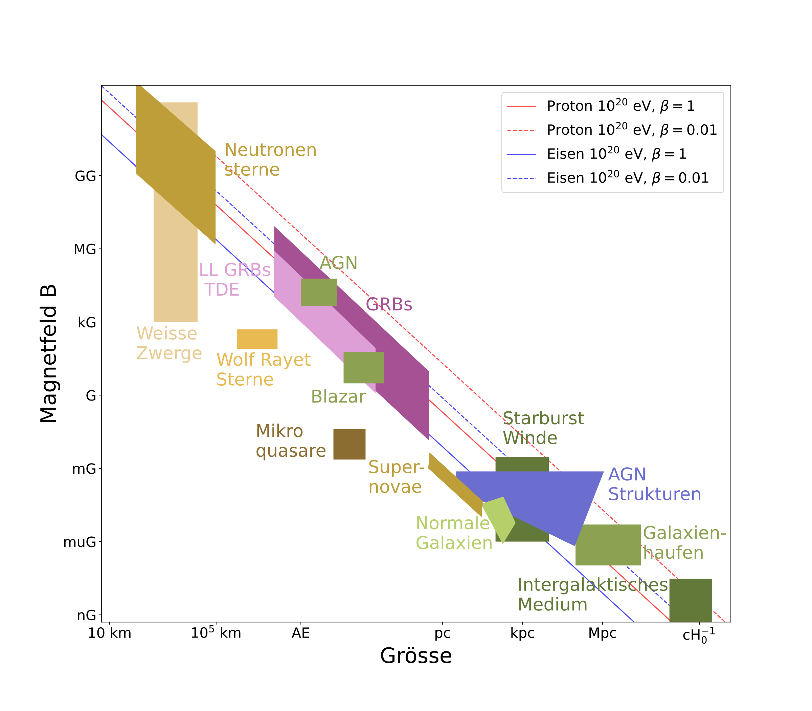

# Hillas Plot

[](https://mybinder.org/v2/git/https%3A%2F%2Fgithub.com%2FGernotMaier%2FHillasPlot/Master)

Showing upper limits on the reachable cosmic ray energy dependent on the size of the acceleration region and the magnetic field strength.

**Simplified version** - based on publications (see below) with some approximations.

German version (english version can be easily prepared with the notebook):



# Technical

Notebook used for plotting. All packages can be installed using conda (matplotlib, astropy, pyyaml)

```
conda env create -f environment.yml
conda activate HillasPlot
```

Data of all objects to be drawn is read from two yaml files.

[HillasObjects.yaml](HillasObjects.yaml):
List of objects to be plotted. Given is object type (Marker, Rectangle, Trapezoid), coordinates, and labels. 
Setting labels for english version (`label_en`) needs a bit of fine tuning.

[ParticleAcceleration.yaml](ParticleAcceleration.yaml):
List of lines to be drawn for maximal achievable energy using the Hillas formula:
```math
B_{\mu G}L_{pc}>2E_{15}/Z\beta
```

# References

1. Hillas, M., [Ann. Rev. Astron. Astrophys. 1984 22:425](https://doi.org/10.1146/annurev.aa.22.090184.002233)
2. Ptitsyna, Kseniya V.; Troitsky, Sergei V., Physics Uspekhi, Volume 53, Issue 7, pp. 691-701 (2010). [arXiv:0808.0367](https://arxiv.org/abs/0808.0367)
3. Lobato, Ronaldo V.; Coelho, Jaziel G.; Malheiro, M., [2017JPhCS.861a2005L](https://ui.adsabs.harvard.edu/link_gateway/2017JPhCS.861a2005L/doi:10.1088/1742-6596/861/1/012005)
4. Artsen, M.G., et al, Advances in Space Research, Volume 62, Issue 10, p. 2902-2930; [arXiv:1701.03731](https://arxiv.org/abs/1701.03731) (Figure 1)
5. Alves Batista, R., Biteau, J., Bustamante, M., et al., 2019, Frontiers in Astronomy and Space Sciences, 6, 23. [arXiv:1903.06714](https://arxiv.org/abs/1903.06714) (Figure 11)
